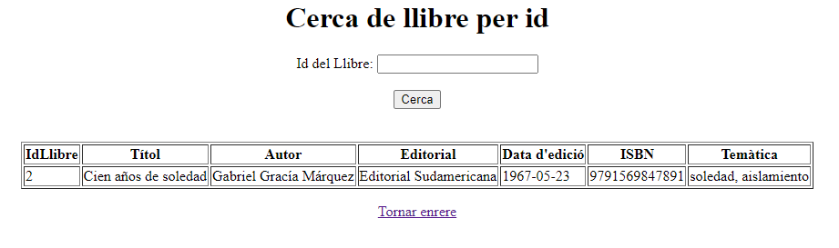
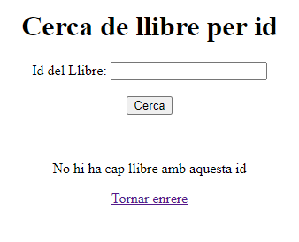

# <U>TEST DE PRUEBA</U>

### **Insert con éxito**

    

  

 

### **Consulta llibres + insert nuevo añadido**

    

  

 

### **ERROR: el isbn si tiene una longitud de 13 pero no empieza por 978 o 979**

    

  

 

### **ERROR: el isbn si empieza por 978 o 979 pero no tiene una longitud de 13**

    

  

 

### **Encuentra el ID con éxito**

    

  

 

### **ERROR: ID fuera del rango de registros**

    

  

 

### **ERROR: se introdujo letras en la búsqueda**

    

  

 

# <U>PREGUNTES DE RELEXIÓ</U>

### **Per què al servei estem utilitzant mètodes que no hem declarat explícitament al repositori? Com és possible?**  

A la interfície LlibreService, quan declarem un mètode com **findByTitol**(String titol), Spring Data JPA ens permet que ens retorni un llibre sense haver d’escriure la consulta manualment.  
Això passa perquè **Spring Data JPA** genera automàticament una consulta SQL basant-se en el nom del mètode, sempre que aquest inclogui el nom d'un atribut de la classe Llibre.

El que passa és que si posem "findBy" seguit del nom d'un atribut de la classe (findByTitol, findByAutor, etc.), Spring ja sap que ha de buscar per aquell camp y generar la consulta SQL. El mateix passa amb deleteBy i altres prefixos. Per això podem utilitzar mètodes que no hem declarat explícitament.

### **El repositori pot elegir fer l’extends de les interfícies PagingAndSortingRepository o de JpaRepository. En què es diferencien aquestes dues amb la interfície CrudRepository?**

- **CrudRepository:**  
La interfície **CrudRepository<T, ID>** només proporciona operacions bàsiques de CRUD.

- **PagingAndSortingRepository:**  
Hereta tots els mètodes de **CrudRepository**. Aquesta interfície afegeix dos mètodes, un per a la paginació i un altre per a l’ordenació: **findAll(Pageable pageable)** i **findAll(Sort sort)**.

- **JpaRepository:**  
Hereta tots els mètodes de **PagingAndSortingRepository**, i per tant, també tots els de **CrudRepository**.  
Aquesta interfície implementa mètodes més avançats com: **flush()**, **saveAndFlush()**, **deleteInBatch()**, **deleteAllInBatch()**, **etc**.

### **Què significa Optional< Classe> i per a què serveix?**
Optional<Classe> és un contenidor que encapsula un valor que pot ser present o buit, evitant errors de NullPointerException.

Quan fem un findBy, ens retorna un Optional, el que ens obliga a comprovar si l'objecte existeix abans d'usar-lo.

Té mètodes útils com isPresent() per saber si hi ha un valor, get() per obtenir-lo si existeix, etc.

### **Per què el controlador utilitza el servei i no la seva implementació?** 
